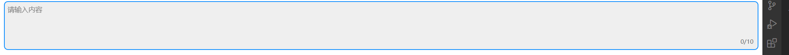

### install

```
wang-message-editor
```

### use

main.js

```js
import Vue from 'vue'
import wangMessageEditor from "wang-message-editor";
Vue.use(wangMessageEditor)
```


```vue
<template>
  <div id="app">
    <wangMessageEditor @input="input" :limitInputLength="0" 
      ref="editRef"
	/>
  </div>
</template>

<script>
import wangMessageEditor from "./components/index";
export default {
  name: "App",
  data() {
    return {};
  },
  components: {
    wangMessageEditor,
  },
  methods: {
    input(e) {
      console.log(e);
    },
      清空输入框内容fn
    clear(){
        this.$refs.editRef.clear()
    }
  },
};
</script>
```


### methods

| 参数                   | 说明             | 参数                                                         | 备注                       |
| :--------------------- | :--------------- | :----------------------------------------------------------- | -------------------------- |
| input                  | 输入框改变事件   | 当设置 `limitInputLength` 大于0时，输出参数为{content: 'we', isOverflow: false}；<br />当设置 `limitInputLength` 为0时，输出参数为 当前输入的内容字符串，而非对象 |                            |
| clear                  | 清空editor       |                                                              |                            |
| focus                  | editor获取焦点   |                                                              |                            |
| setContent             | 设置输入框内容   | 参数为字符串                                                 | 多次调用，会覆盖上次的内容 |
| setTextContentAdd      | 追加内容(文本)   | string                                                       |                            |
| setHyperTextContentAdd | 追加内容(超文本) | html  字符串格式的 html，例如 <br /> `<a href="www.xx.com"> a</a>` |                            |
|                        |                  |                                                              |                            |
|                        |                  |                                                              |                            |


### props

`limitInputLength` 输入框字数限制， 

| 参数             | 参数类型 | 功能           |
| ---------------- | -------- | -------------- |
| limitInputLength | Number   | 输入框字数限制 |
|                  |          |                |

### 效果展示

